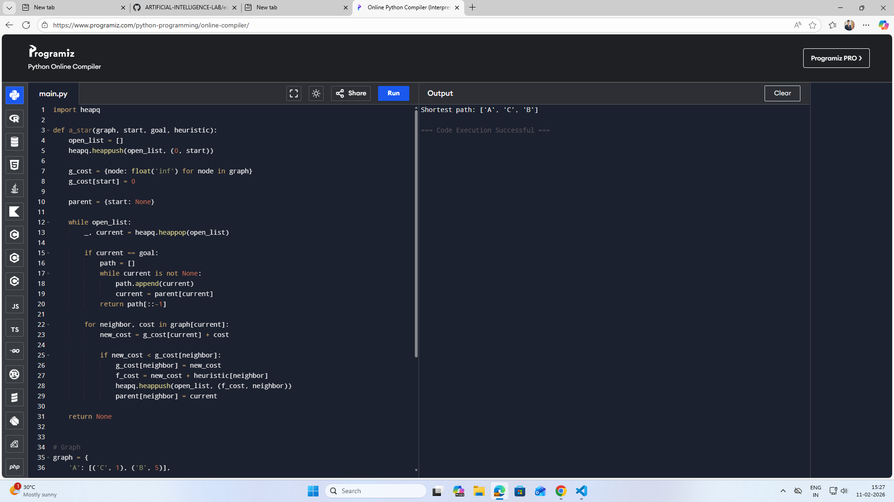

# 🤖 BE AIML – Artificial Intelligence Lab Experiments

This repository contains **Artificial Intelligence Laboratory experiments** developed as part of the
**B.E. Artificial Intelligence & Machine Learning (AIML)** curriculum.

---

## 👨‍🎓 Student Details

* **Student Name:** Kamesh
* **Subject:** Artificial Intelligence Lab
* **Languages Used:** Python, Java

---

## 📂 Experiments List

---

##  Experiment 1: Solving N-Queens Problem

**Aim:**
To implement the N-Queens problem using backtracking in Python.

**Description:**
The N-Queens problem is a constraint satisfaction problem where **N queens** must be placed on an **N × N chessboard** such that no two queens attack each other.

**Algorithm:**

1. Place a queen in the first column
2. Check if the position is safe
3. If safe, move to the next column
4. If not safe, backtrack
5. Repeat until all queens are placed

**File:** `exp1/queen.py`

**Output / Result:**


---

##  Experiment 2: A* Algorithm

**Aim:**
To implement the A* search algorithm in Python.

**Description:**
A* is a heuristic search algorithm used to find the **shortest path between nodes in a graph**.

Formula:

> **f(n) = g(n) + h(n)**

Where:

* **g(n)** = cost from start node
* **h(n)** = heuristic estimate to goal

**Algorithm:**

1. Initialize open and closed lists
2. Add start node to open list
3. Select node with lowest f(n)
4. Expand neighbors
5. Repeat until goal is reached

**File:** `exp2/a*.py`

**Output / Result:**



---

##  Experiment 3: Hill Climbing Algorithm

**Aim:**
To implement the Hill Climbing algorithm using Java.

**Description:**
Hill Climbing is a **local search algorithm** that continuously moves toward increasing value to find the peak (optimal) solution.

**Algorithm:**

1. Start with an initial state
2. Evaluate neighboring states
3. Select the best neighbor
4. Move to that neighbor
5. Repeat until no better neighbor exists

**File:** `hillclimb.java`

**Output / Result:**


---

##  Experiment 4: Game Playing Algorithms

### (i) Minimax Algorithm

**Aim:**
To implement the Minimax algorithm for decision-making in game theory.

**Description:**
Minimax is a recursive algorithm used in **two-player games** where one player maximizes and the other minimizes the score.

**Algorithm:**

1. Define the game tree
2. Assign utility values to terminal states
3. Recursively evaluate nodes
4. Choose the optimal move

**File:** `exp4/minmax.py`

**Output / Result:**


---

### (ii) Alpha-Beta Pruning

**Aim:**
To implement Alpha-Beta Pruning to optimize the Minimax algorithm.

**Description:**
Alpha-Beta pruning reduces the number of nodes evaluated by eliminating branches that do not affect the final decision.

**Algorithm:**

1. Initialize alpha = −∞ and beta = +∞
2. Apply Minimax logic
3. Prune branches when beta ≤ alpha
4. Return optimal value

**File:** `exp4/alpha-beta.py`

**Output / Result:**


---

##  Experiment 5

**Title:** To be added
**Description:** To be added

---

## 📁 Folder Structure

```
AI-Lab-Experiments/
│
├── experiment.png
│
├── exp1/
│   ├── queen.py
│   └── queen.png
│
├── exp2/
│   ├── a*.py
│   └── a*.png
│
├── hillclimb.java
├── README.md
│
├── exp3/
│   └── hillclimb.png
│
└── exp4/
    ├── minmax.py
    ├── alpha-beta.py
    ├── minmax.png
    └── alpha-beta.png
```

---

## ✅ Conclusion

This repository is created for **academic learning purposes** to understand and implement important Artificial Intelligence algorithms as part of the **B.E. AIML curriculum**. These experiments demonstrate practical applications of AI concepts such as search algorithms, optimization, and game theory.

---

⭐ *Feel free to explore, learn, and improve these implementations!*
