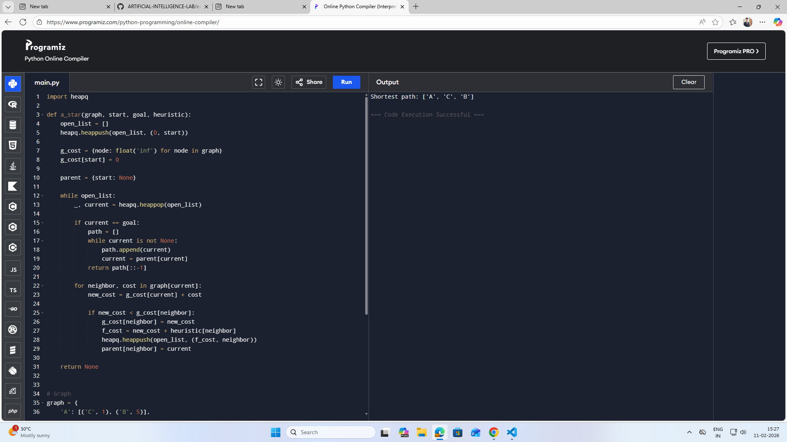
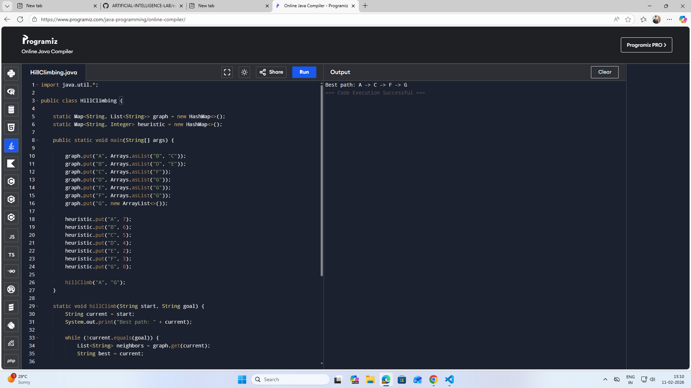
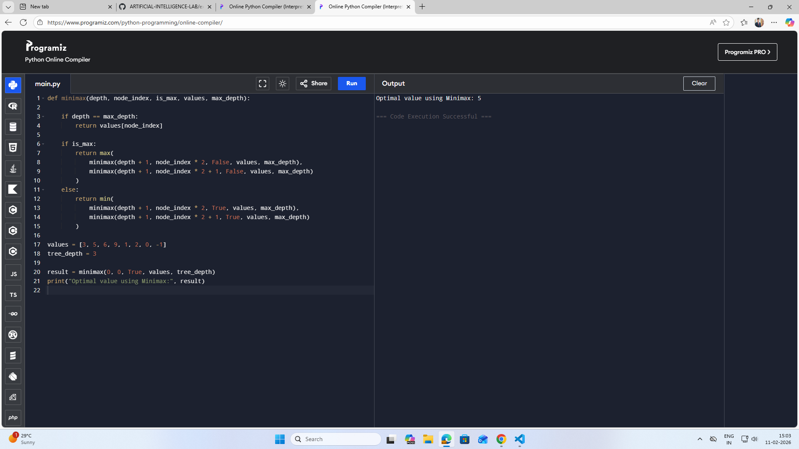
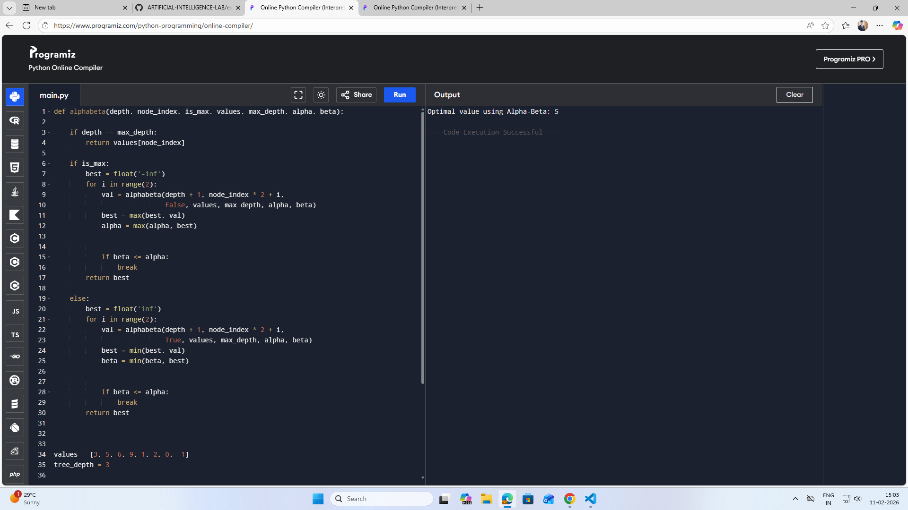

🤖 BE AIML – Artificial Intelligence Lab Experiments

This repository contains Artificial Intelligence Laboratory experiments developed as part of the
B.E. Artificial Intelligence & Machine Learning (AIML) curriculum.

---

👨‍🎓 Student Details

Detail	Information

Student Name	Kamesh
Course	B.E Artificial Intelligence & Machine Learning
Subject	Artificial Intelligence Lab
Languages Used	Python, Java, Prolog

---

📂 Experiments List

---

 Experiment 1: Solving N-Queens Problem

🎯 Aim

To implement the N-Queens problem using backtracking in Python.

📖 Description

The N-Queens problem is a constraint satisfaction problem where N queens must be placed on an N×N chessboard so that no two queens attack each other.

🧠 Algorithm

1. Place a queen in the first column

2. Check if the position is safe

3. If safe, move to the next column

4. If not safe, backtrack

5. Continue until all queens are placed

📄 File

exp1/queen.py

🖥 Output

---

 Experiment 2: A* Algorithm

🎯 Aim

To implement the A search algorithm*.

📖 Description

A* is a heuristic search algorithm used to find the shortest path between nodes in a graph.

Formula

f(n) = g(n) + h(n)

Term	Meaning

g(n)	Cost from start node
h(n)	Heuristic estimate to goal

📄 File

exp2/a*.py

🖥 Output

---

 Experiment 3: Hill Climbing Algorithm

🎯 Aim

To implement Hill Climbing Algorithm using Java.

📖 Description

Hill Climbing is a local search optimization algorithm that continuously moves toward increasing value to reach the optimal solution.

📄 File

hillclimb.java

🖥 Output

---

 Experiment 4: Game Playing Algorithms

(i) Minimax Algorithm

🎯 Aim

To implement Minimax algorithm for game decision making.

📄 File

exp4/minmax.py

🖥 Output

---

(ii) Alpha-Beta Pruning

🎯 Aim

To implement Alpha-Beta pruning to optimize Minimax.

📄 File

exp4/alpha-beta.py

🖥 Output

---

 Experiment 5: Prolog Programs

🎯 Aim

To implement Artificial Intelligence problems using Prolog and First Order Predicate Logic.

📖 Description

Prolog is a logic programming language widely used in Artificial Intelligence for knowledge representation, rule-based reasoning, and symbolic computation.

This experiment demonstrates several classic AI problems implemented using Prolog.

---

📌 Programs Implemented

---

1️⃣ First Order Predicate Logic

📄 File

exp5/first-order.pl

Query

?- parent(john,mary).
?- grandparent(john,sam).
?- female(alice).

Output

true
true
true

---

2️⃣ Arithmetic Operations

📄 File

exp5/arithmetic.pl

Queries

?- add(5,3,Z).
?- sub(5,3,Z).
?- mul(5,3,Z).
?- div(5,5,Z).

Output

Z = 8
Z = 2
Z = 15
Z = 1

---

3️⃣ Factorial Program

📄 File

exp5/factorial.pl

Query

?- fact(5,F).

Output

F = 120

---

4️⃣ Fibonacci Series

📄 File

exp5/fibonacci.pl

Query

?- fib(6,F).

Output

F = 8

---

5️⃣ Monkey Banana Problem

📄 File

exp5/monkey-banana.pl

Description

Classic AI planning problem where a monkey must move a box and climb it to reach a banana.

Output

Monkey successfully reaches the banana

---

6️⃣ Water Jug Problem

📄 File

exp5/water-jug.pl

Query

?- goal(state(2,_)).

Output

Water jug problem solved successfully

---

7️⃣ 8 Puzzle Problem

📄 File

exp5/eight-puzzle.pl

Query

?- solve([1,2,3,4,5,6,7,8,0]).

Output

Goal state reached

---

8️⃣ N-Queen Problem (Prolog)

📄 File

exp5/nqueen.pl

Query

?- queen(4,X).

Output

X = [2,4,1,3]

---

📁 Folder Structure

AI-Lab-Experiments
│
├── README.md
├── experiments.png
│
├── exp1
│   ├── queen.py
│   └── queen.png
│
├── exp2
│   ├── a*.py
│   └── a*.png
│
├── exp3
│   └── hillclimb.png
│
├── exp4
│   ├── minmax.py
│   ├── alpha-beta.py
│   ├── minmax.png
│   └── alpha-beta.png
│
├── hillclimb.java
│
└── exp5
    ├── first-order.pl
    ├── arithmetic.pl
    ├── factorial.pl
    ├── fibonacci.pl
    ├── monkey-banana.pl
    ├── water-jug.pl
    ├── eight-puzzle.pl
    └── nqueen.pl

---

✅ Conclusion

This repository demonstrates practical implementation of Artificial Intelligence algorithms and logic programming concepts as part of the B.E Artificial Intelligence & Machine Learning curriculum.

The experiments include:

Search Algorithms

Optimization Techniques

Game Playing Algorithms

Logic Programming using Prolog

These implementations help understand core AI concepts through hands-on laboratory experiments.

---

⭐ If you find this repository useful, consider giving it a star!

